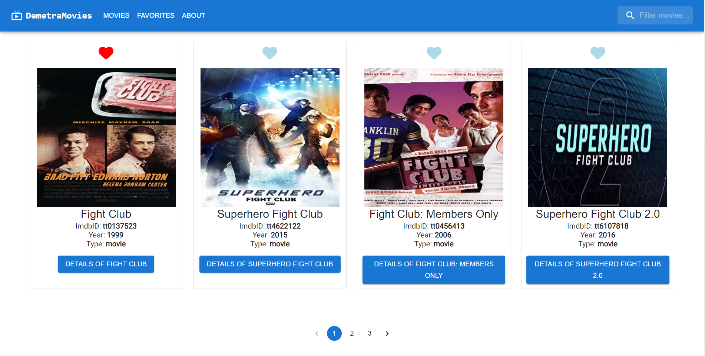
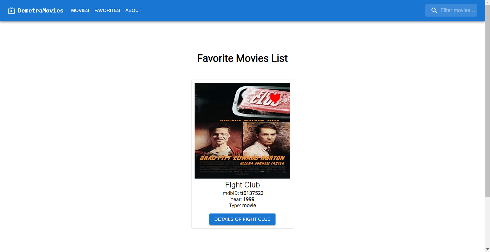

This is an app for finding great movies.
Technologies used: React / Next.js / TypeScript / Material UI




1. Make sure you have Node.js installed
2. Clone the repo on your device
3. Run ```npm install```
4. Then to run this app:
```bash
npm run dev
# or
yarn dev
# or
pnpm dev
```

Open [http://localhost:3000](http://localhost:3000) with your browser to see the result.

You can start editing the page by modifying `pages/[movieSlug].tsx`. The page auto-updates as you edit the file.
